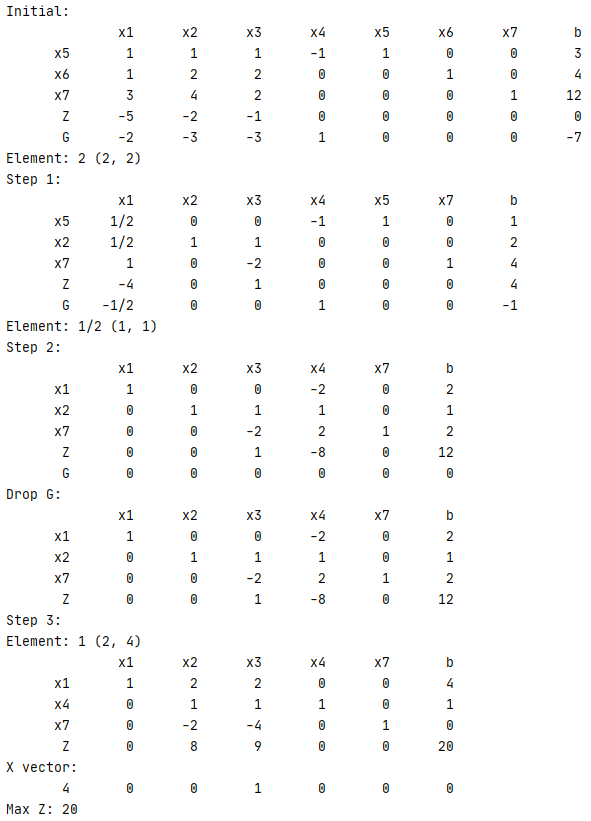

# Simplex-Table
Программа ищет минимум или максимум заданной функции при наложенных ограничениях симплекс методом с искусственным базисом.

## Инструкция

1) Введите колличесво переменных в уравнении:  
    **пример**: для x1 + 2x2 + x3 = 4 введите 3.  
2) Введите колличесво ограничений (не учитывая целевую функцию).
3) введдите коэффициенты и знаки для уравнений. Считать ">=" как ">" и "<=" как "<":  
    **пример**: для x1 + 2x2 + x3 >= 4 введите 1 2 1 > 4. 
4) После ввода всех ограничений введите коэффициенты для целевой функции (учитывая свободный член):  
    **пример**: для Z(x) = 2x1 - x2 введите 2 -1 0.
5) Если нужно найти максимальное значение введите "y" (yes). Для минимального введите "n" (no).

## Вывод

Если решение существует, программа выведет вектор x со всеми вспомогательными переменными и само значение Z.
Если решения нет, то будет выведено "No solution".

## Пример работы программы

